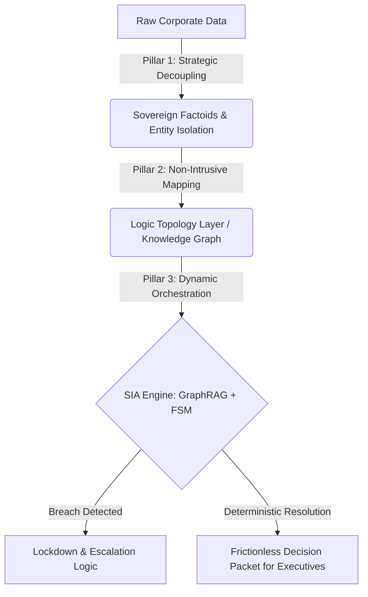

# Systems Logic & Human-Centric AI Governance

Senior Infrastructure Architect & Fractional CTO with 20+ years of workforce experience. I bridge the gap between hard system engineering and high-level business risk management. My work transforms raw, volatile AI intelligence into stable, deterministic corporate layers, ensuring that digital transformation always serves human intent rather than introducing operational entropy.

---

## 🏛️ The Foundational Philosophy: SIA 1.0 (Strategic Intent Architecture)

We are witnessing a global, FOMO-driven rush toward 100% digital automation. However, when a system becomes a frictionless "black box," it loses its physical anchor. A single hallucination or fraud vector can collapse a digital utopia into systemic risk. 

SIA 1.0 is engineered not as another AI utility, but as a rigid **Governance Layer** to protect human agency and corporate integrity through three core pillars:

*   **Intent-Based Calibration (Pre-emptive De-escalation)**
    AI's primary value is not in "processing data," but in *decoding intent*. By identifying human anxiety or anomalous behavior before friction occurs, the architecture de-escalates operational risks before they manifest as financial costs.
*   **The Trust Anchor (Immutable Physical Proof)**
    Digital data is transient; physical reality is certain. For high-stakes operations (Banking, Medical, Insurance), SIA mandates a Physical Proof Layer—whether a mechanical embossed card or a proximity-locked terminal—anchoring digital truth to an undeletable physical artifact.
*   **Calculated Friction (The Ethics of Resilience)**
    "Zero-Friction" models are inherently dangerous. SIA introduces strategic buffers, reflection periods, and human-in-the-loop escalations to ensure AI strictly serves corporate governance rather than mere processing speed.

> *"We don't build AI to accelerate the flow; we build SIA to govern the truth."*

---

## 🛠️ The Implementation Blueprint: SIA 2.0 (Sovereign Infrastructure Architecture)

Enterprise AI transformations routinely fail because organizations force advanced probabilistic intelligence into rigid, centralized legacy systems. **SIA 2.0** translates the governance philosophy of 1.0 into an executable technical blueprint, decoupling logical context from physical storage to establish absolute data sovereignty without disrupting legacy systems.

# 🚀 The 3 Execution Pillars of SIA 2.0

## Pillar 1: Strategic Decoupling (Semantic Granularity)
Smashes rigid database tables into autonomous, independent units of facts ("Factoids") to eliminate semantic noise, data leakage, and hallucination vectors at the physical layer.

## Pillar 2: Non-Intrusive Implementation (Logic Topology)
Utilizes LLMs to asynchronously scan isolated Factoids and build an abstracted multi-dimensional knowledge graph. This relational mesh shadows existing production databases without altering a single row of legacy data.

## Pillar 3: Resource Entropy & Orchestration (Deterministic Governance)
Combines GraphRAG multi-hop reasoning with Finite State Machines (FSM). When a complex threat is detected, the system overrides linear scripts, stops probabilistic guessing, and compiles data into a definitive, auditable **Decision Packet** for senior management.

---

# ⚡ Active Repositories & Tech Portfolio

### 🔧 SIA-2.0-Core-Engine
**Executive Summary:**  
The concrete JavaScript technical blueprint enforcing the Sovereign Infrastructure Architecture framework. It features an asynchronous relationship extraction network and an invariant runtime interception layer to act as a deterministic governor for multi-agent corporate systems.  

**Key Specs:**  
- Non-intrusive metadata isolation  
- GraphRAG logic layer compilation  
- FSM state boundaries  

**Target Audience:** CTOs, Chief Risk Officers, Enterprise Architects  
**Topics:** #ai-governance #enterprise-architecture #zero-trust #graphrag #systemic-design  

---

### 🧠 Thought-Synthesis-App (Mind Filter)
**Executive Summary:**  
A human-centric cognitive optimization application designed to solve a pervasive enterprise pain point: management demanding aggressive AI efficiency KPIs while employees experience cognitive overwhelm and lack execution clarity. Mind Filter bridges the human-AI context gap by turning chaotic daily operations into structured thought matrices.  

**Key Specs:**  
- Real-time information decoupling  
- Thought synthesis layer  
- Human-in-the-loop decision mapping  

**Target Audience:** Operations Directors, Change Management Leads, Human-Centric Design Practitioners  
**Topics:** #human-centric-ai #cognitive-ergonomics #digital-transformation #knowledge-management  

---

# 🎯 High-Level Core Competencies
- **Systemic Architecture Design:** Mitigating systemic risk and operational paralysis in multi-million dollar transformation gambles.  
- **Intent-Based Calibration:** Moving AI integration away from "zero-friction" trust collapses and towards calculated, strategic buffer layers.  
- **Sovereign Data Security:** Ensuring original enterprise data remains stationary while utilizing metadata topology to securely fuel multi-agent autonomy.  

---

📌 *This document was structured with the help of AI, and curated by Sana.M.*
